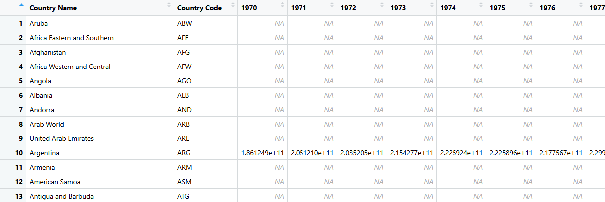

```{r}
#| eval: false
#| include: false
install.packages("gt")
```

```{r}
#| include: false
library(tidyverse)
library(dplyr)
library(conflicted)
library(gt)
conflicts_prefer(dplyr::filter)
conflicts_prefer(dplyr::lag)

```

```{r}
#| include: false
# included for initial csv reading
readr::read_csv("country_codes.csv")

# Adjusted Net National Income
readr::read_csv("AdjustedNetNationalIncome/API_NY.ADJ.NNTY.KD_DS2_en_csv_v2_3377.csv")
readr::read_csv("AdjustedNetNationalIncome/Metadata_Country_API_NY.ADJ.NNTY.KD_DS2_en_csv_v2_3377.csv")
readr::read_csv("AdjustedNetNationalIncome/Metadata_Indicator_API_NY.ADJ.NNTY.KD_DS2_en_csv_v2_3377.csv")

# World Bank total population
readr::read_csv("world_bank_total_population/Metadata_Indicator_API_SP.POP.TOTL_DS2_en_csv_v2_267553.csv")
readr::read_csv("world_bank_total_population/API_SP.POP.TOTL_DS2_en_csv_v2_267553.csv")
readr::read_csv("world_bank_total_population/Metadata_Country_API_SP.POP.TOTL_DS2_en_csv_v2_267553.csv")

```

# Task 1: Tidyverse Data Workflow

## Task 1.1: Cleaning the Data

This project analyses the indicator “Adjusted net national income (constant 2015 US$)” from the world bank. This indicator measures a country’s gross national income after subtracting the consumption of fixed capital and the depletion of natural resources. In simpler terms, it adjusts national income to account for the wearing out of produced assets, such as machinery and buildings, as well as the loss of natural resources, such as forests, energy resources, and minerals. The indicator is measured in constant 2015 US dollars, which means the values have been adjusted for price changes over time, allowing comparisons across different years without inflation distorting the results. This makes the indicator useful for studying long-term economic trends. It is important because ordinary income measures may make a country appear wealthier even when that growth depends on using up natural resources or replacing damaged capital. By analysing adjusted net national income, we can better understand whether countries are experiencing more sustainable forms of economic growth.

{#fig-wb-screenshot}

```{r}
# Task 1.1: Cleaning the Data
clean_up_wb_csv <- function(
    in_file_name,
    out_file_name) {
  
  is_empty <- function(x) {
    if (is.character(x)) {
      is.na(x) | trimws(x) == ""
    } else {
      is.na(x)
    }
  }
  
  wb_data <- read_csv(
    in_file_name,
    skip = 4,
    na = c("", "NA", ".."),
    show_col_types = FALSE
  ) |>
    # Clean column names
    rename_with(trimws) |>
    
    # Remove columns C and D, if they exist
    select(-any_of(c("Indicator Name", "Indicator Code"))) |>
    
    # Remove completely empty columns
    select(where(~ !all(is_empty(.x)))) |>
    
    # Remove completely empty rows
    filter(if_any(everything(), ~ !is_empty(.x))) |>
    
    # Remove rows without country names
    filter(
      !is.na(`Country Name`),
      trimws(`Country Name`) != ""
    )
  
  write_csv(wb_data, out_file_name)
  
  return(wb_data)
}
```

```{r}
# Task 1.2: Importing the Data as Data Frame
clean_up_wb_csv("AdjustedNetNationalIncome/API_NY.ADJ.NNTY.KD_DS2_en_csv_v2_3377.csv", "indicator.csv")
indicator <- read_csv("indicator.csv")


clean_up_wb_csv("world_bank_total_population/API_SP.POP.TOTL_DS2_en_csv_v2_267553.csv", "population.csv")
population <- read_csv("population.csv")
```

```{r}
# Task 1.3: Removing Rows not Pertaining to Countries
country_codes <- read_csv("country_codes.csv")
nrow(indicator)
nrow(population)

reducing_function <- function(
    old_table, new_table, country_codes) {
  new_table <- old_table |>
  semi_join(country_codes, by = c("Country Code" = "country_code"))
}

population_reduced <- reducing_function(population, population_reduced, country_codes)
indicator_reduced <- reducing_function(indicator, indicator_reduced, country_codes)

population_reduced
indicator_reduced

```